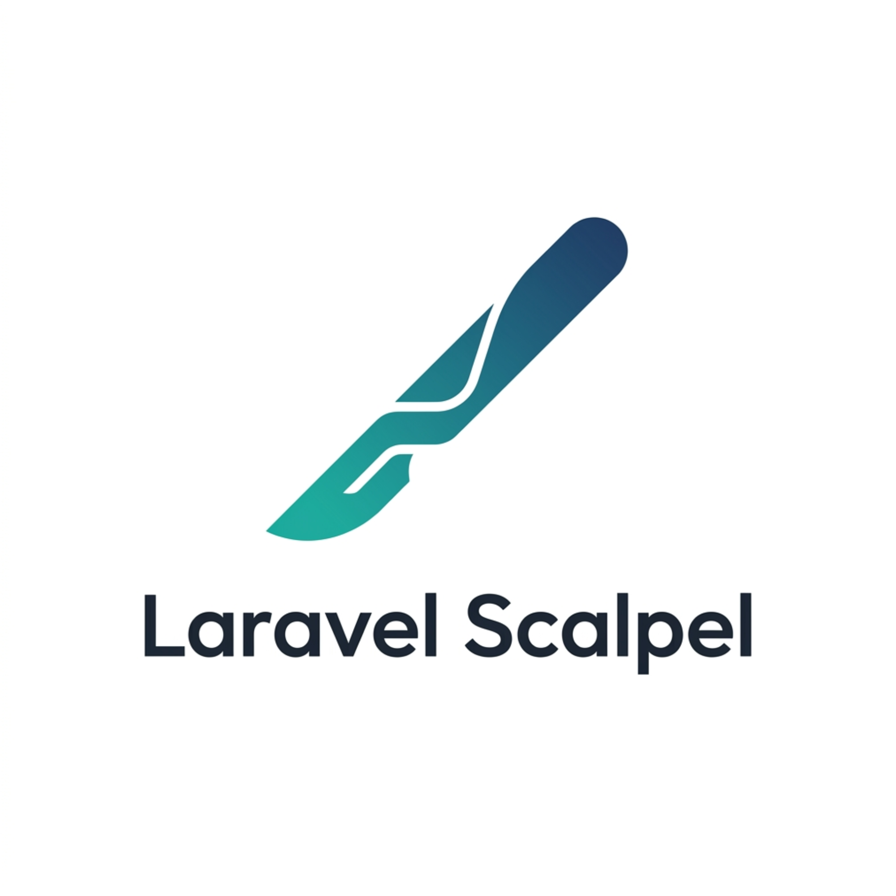

<p align="center">
  
</p>

<h1 align="center">Contributing to Laravel Scalpel</h1>

Thank you for your interest in contributing to **Laravel Scalpel**! We welcome and appreciate all contributions, from reporting bugs to suggesting new features and writing code.

By participating in this project, you help make Laravel applications more secure for everyone.

---

## Table of Contents

- [Code of Conduct](#code-of-conduct)
- [How Can I Contribute?](#how-can-i-contribute)
  - [Reporting Bugs](#reporting-bugs)
  - [Suggesting Enhancements](#suggesting-enhancements)
  - [Pull Requests](#pull-requests)
- [Development Setup](#development-setup)
  - [Prerequisites](#prerequisites)
  - [Step-by-Step Setup](#step-by-step-setup)
  - [Running Tests](#running-tests)
- [Coding Standards](#coding-standards)
- [License](#license)

---

## Code of Conduct

We expect all contributors to adhere to a respectful and welcoming environment. Please treat other community members with respect, empathy, and professionalism.

---

## How Can I Contribute?

### Reporting Bugs

If you find a security scanner failure, unexpected false positives, or bugs in the commands:
1. **Search existing issues** to see if the bug has already been reported.
2. If it hasn't, **open a new issue**. Use a clear and descriptive title.
3. Provide details:
   - Laravel & PHP versions.
   - Steps to reproduce the issue.
   - The expected vs. actual behavior.
   - Any relevant logs, stack traces, or console output.
   - For false positives: share the code snippet or file path that triggered the scanner.

### Suggesting Enhancements

If you have an idea for a new scanner, security detection pattern, or optimization:
1. Check the existing issues/discussions to ensure it hasn't been suggested.
2. Open a new issue with the tag `enhancement`.
3. Explain:
   - What the feature is and why it's useful.
   - How it should work (concept/design).
   - Any examples of the target backdoor/intrusion vector you want to detect.

### Pull Requests

1. Fork the repository and create your branch from `main`.
2. Include unit/feature tests for any new behavior or bug fixes.
3. Verify that all tests pass locally.
4. Keep your commits atomic, clean, and write descriptive commit messages.
5. Push to your fork and submit a Pull Request (PR) to the `main` branch.
6. Provide a clear description of the changes in your PR description.

---

## Development Setup

### Prerequisites

To set up the development environment, you will need:
- **PHP** 8.1 or higher (PHP 8.2+ recommended)
- **Composer** (v2)

### Step-by-Step Setup

1. **Fork the repository** on GitHub.
2. **Clone your fork** locally:
   ```bash
   git clone https://github.com/your-username/laravel-scalpel.git
   cd laravel-scalpel
   ```
3. **Install dependencies**:
   ```bash
   composer install
   ```

### Running Tests

We use PHPUnit for testing. Before submitting a pull request, make sure all tests pass:

```bash
composer test
```

### Code Style & Static Analysis

Before submitting a pull request, also make sure the code style and static analysis checks pass:

```bash
# Check code style (Laravel Pint)
composer lint

# Automatically fix code style issues
composer lint:fix

# Run PHPStan static analysis
composer analyse
```

If you are developing a new scanner or rule:
- Unit tests live in the `tests/Unit` directory.
- Feature tests (such as artisan command outputs and integration flows) live in the `tests/Feature` directory.
- Use `tests/TestCase.php` to access clean sandbox filesystems during test runs.

---

## Coding Standards

To maintain a clean and consistent codebase:
- **Strict Types**: Always declare strict types (`declare(strict_types=1);`) at the top of PHP files.
- **PSR-12**: Follow the PSR-12 coding standard for code style and formatting.
- **Type Hinting**: Provide strong typing for function arguments and return types where possible.
- **No Heavy Dependencies**: This is a zero-dependency (outside of Laravel/Symfony packages) scanner. Avoid adding external libraries to `composer.json` without discussing it first.

---

## License

By contributing to Laravel Scalpel, you agree that your contributions will be licensed under the MIT License of the project.
